# Punto de Control: C++ -06

- :technologist: **Daniel Isaac Juárez**
- :e-mail: danielisaacjuarez@unitec.edu
---

## 01 - StaticCast

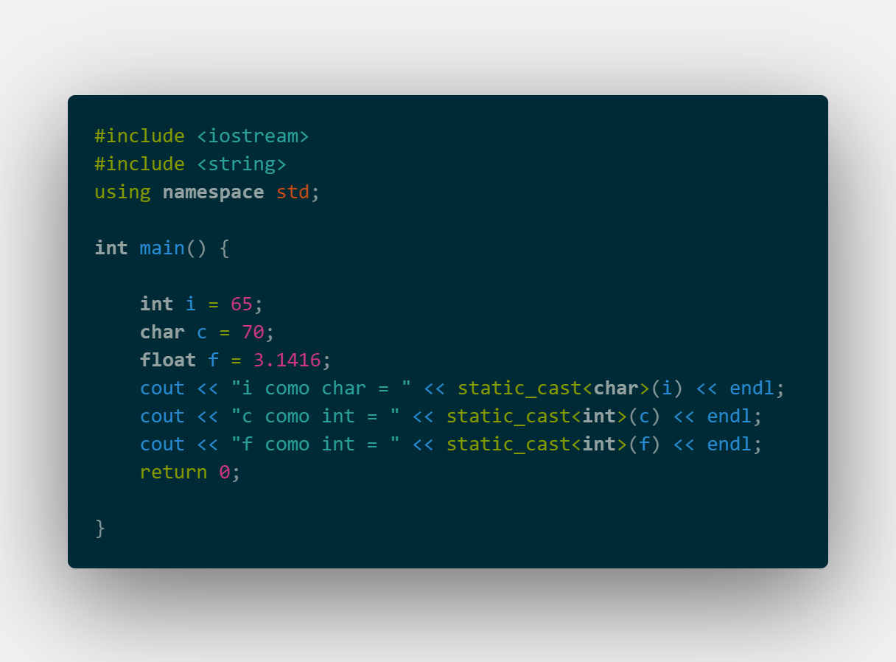

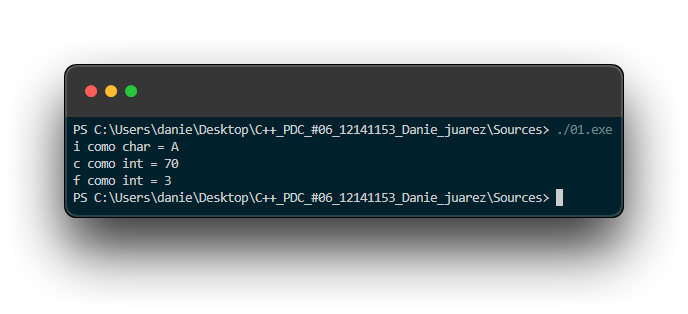

---

## 02 StaticCast Vs DynamicCast 01

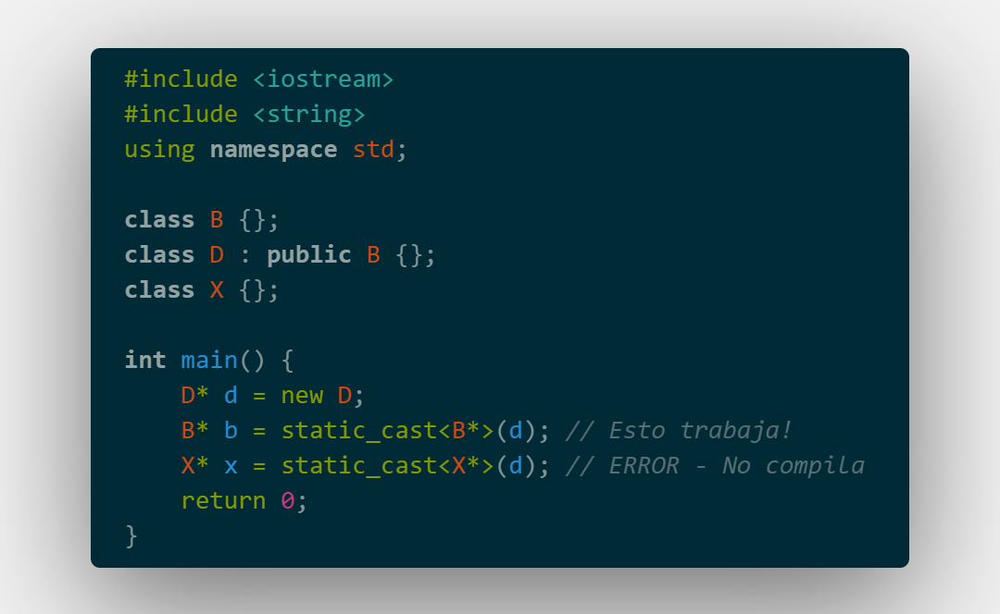

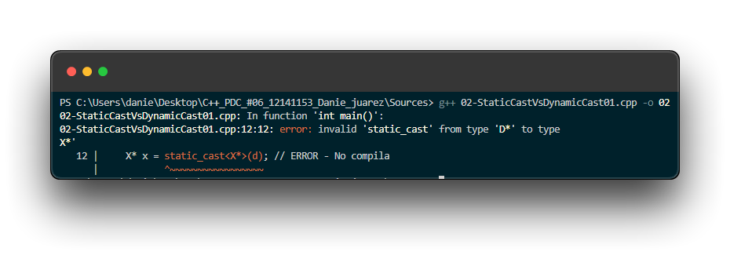

---

## 03 - StaticCast Vs DynamicCast 02

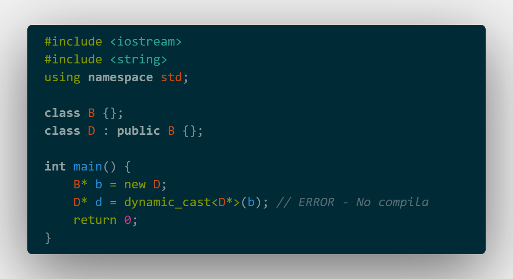

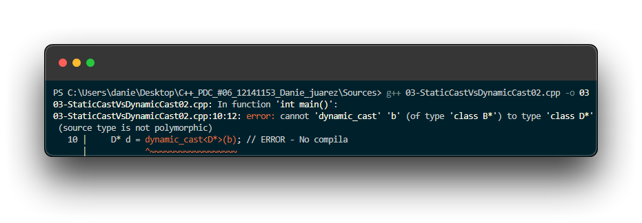

---

## 04 - StaticCast Vs DynamicCast 03

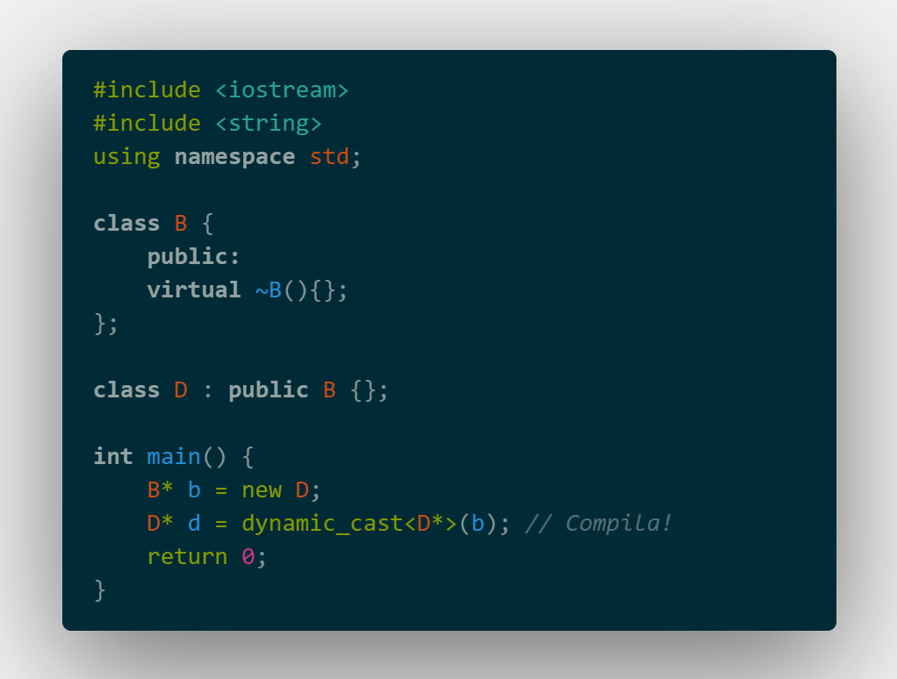

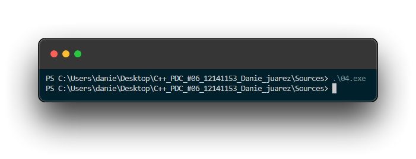

---

## 05 - Funciones Virtuales

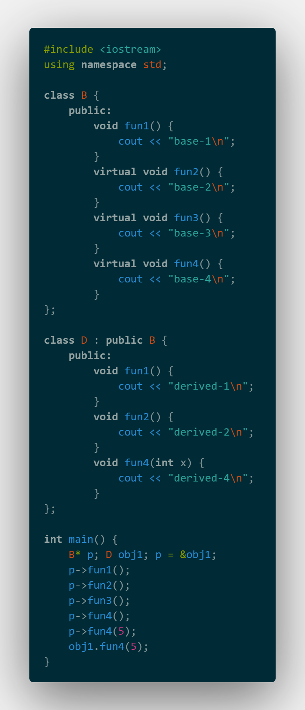

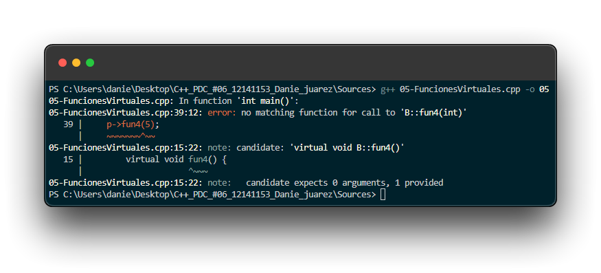

---

## 06 - TypeId

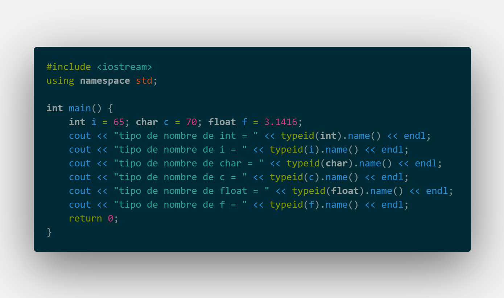

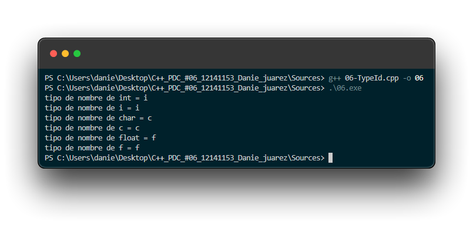

---

## 07 Sobrecarga De Operadores 01

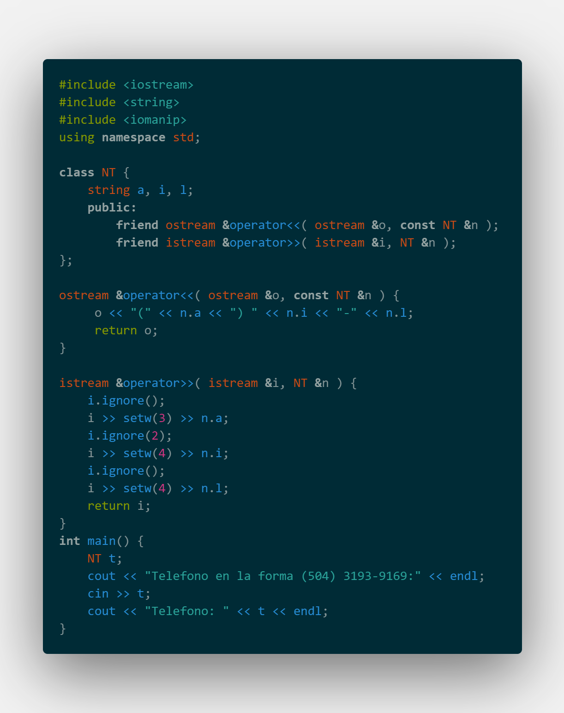

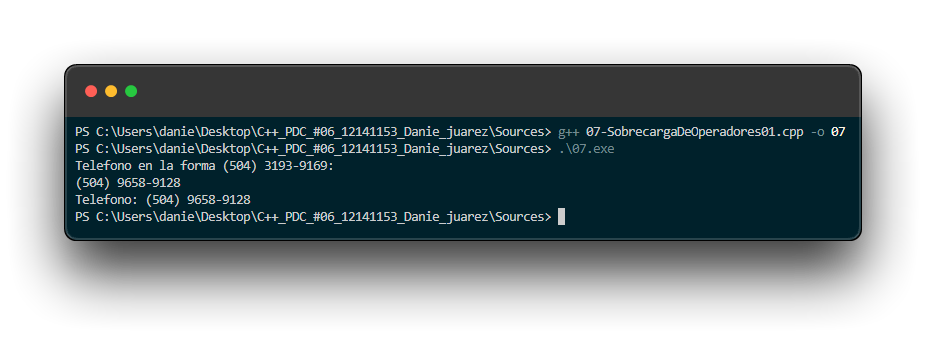

---

## 08 Sobrecarga De Operadores 02

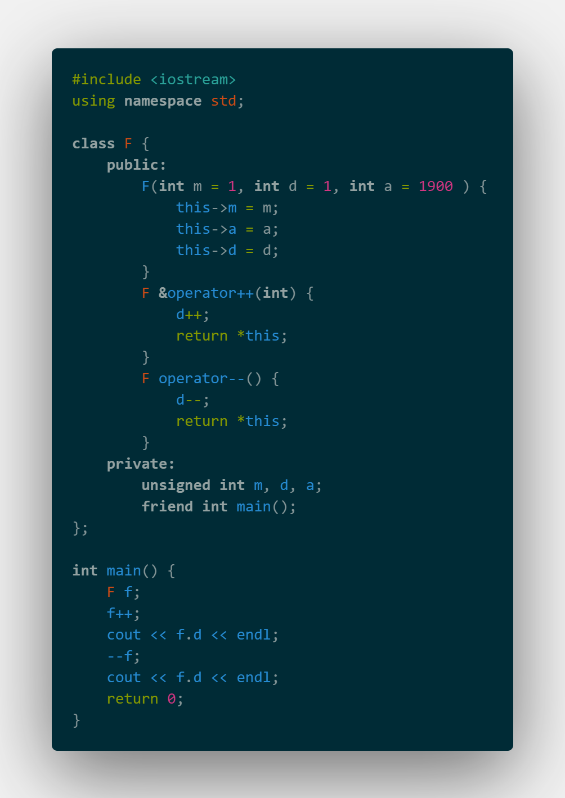

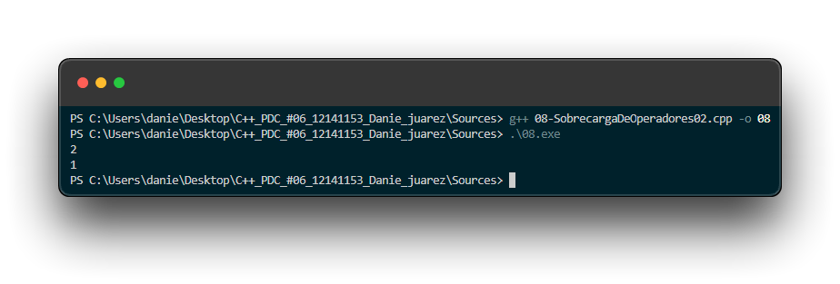

---

## 09 - Ejercicio 05

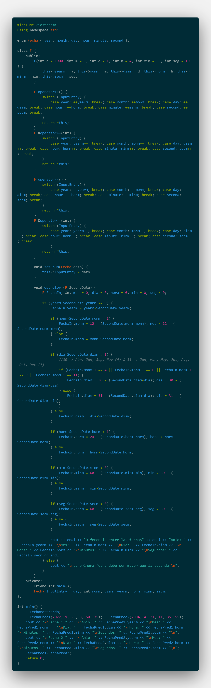

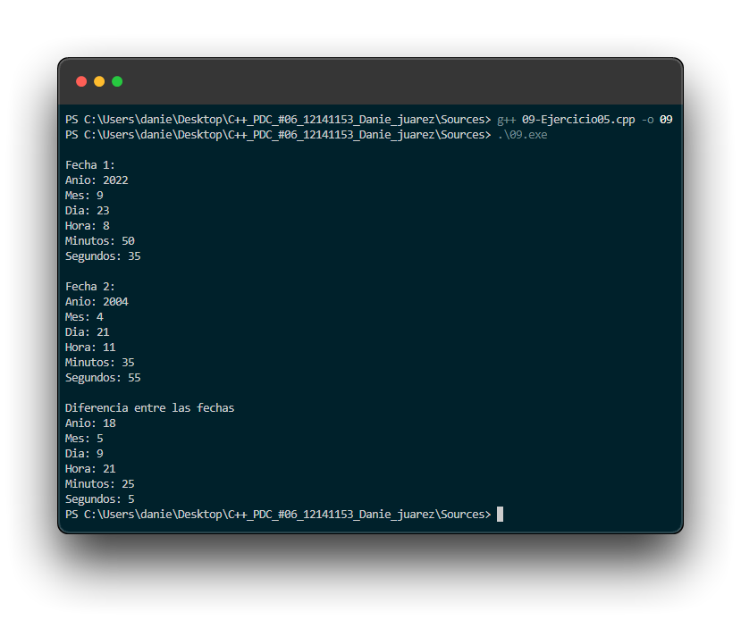

---